# Polytop Library

This Jupyter notebook will demonstrate how to use the Polytop library to load sample ITP files, create monomer instances, and display a 2D representation of molecules.

## Importing the Library

We will import the `polytop` library and confirm the version.


```python
import polytop
from polytop.topology import Topology
from polytop.junction import Junction
from polytop.monomer import Monomer 
from polytop.polymer import Polymer
from polytop.visualize import Visualize
from IPython.display import Image
from IPython.core.display import HTML


```

## Load topology from an ITP file

First, we will load the ITP files for some molecules to use as monomers.  We'll use some amino acids to make a polypeptide.  We'll start by importing `Arginine` using the `Topology.from_ITP()` function. This function will return a `Topology` object that contains all of the information from the ITP file.  Note for display purposes we'll add a double bond manually between the carbon and the second oxygen in the terminal carboxyl group.


```python
ARG = Topology.from_ITP('tests/data/arginine.itp')
print(ARG.atoms)
```

    [AE97.H26->[AE97.N5], AE97.N5->[AE97.H26,AE97.H25,AE97.C12], AE97.H25->[AE97.N5], AE97.C12->[AE97.N5,AE97.N4,AE97.N6], AE97.N6->[AE97.H23,AE97.H24,AE97.C12], AE97.H23->[AE97.N6], AE97.H24->[AE97.N6], AE97.N4->[AE97.C12,AE97.C10], AE97.C10->[AE97.C8,AE97.H18,AE97.N4,AE97.H19], AE97.H18->[AE97.C10], AE97.H19->[AE97.C10], AE97.C8->[AE97.H15,AE97.C10,AE97.H16,AE97.C7], AE97.H15->[AE97.C8], AE97.H16->[AE97.C8], AE97.C7->[AE97.H13,AE97.H14,AE97.C8,AE97.C9], AE97.H13->[AE97.C7], AE97.H14->[AE97.C7], AE97.C9->[AE97.C11,AE97.H17,AE97.N3,AE97.C7], AE97.H17->[AE97.C9], AE97.N3->[AE97.H20,AE97.C9,AE97.H21], AE97.H20->[AE97.N3], AE97.H21->[AE97.N3], AE97.C11->[AE97.C9,AE97.O2,AE97.O1], AE97.O2->[AE97.C11], AE97.O1->[AE97.C11,AE97.H22], AE97.H22->[AE97.O1]]
    

We can visualize the topology as a 2D structure to make sure that this is the molecule we want to use.


```python
Visualize(ARG).draw2D('tests/output/arginine.png',(400,200))
Image(filename='tests/output/arginine.png') 
```


    

    


Now we need to select the terminal amine and the terminal carboxyl group as polymerization junction points in this topology so we can define this topology as a monomer.  First we redraw the topology with explicit hydrogens visible and atom IDs displayed.


```python
Visualize(ARG).draw2D('tests/output/arginine_unordered.png',(400,200),remove_explicit_H=False, show_atom_ID=True)
Image(filename='tests/output/arginine_unordered.png') 
```


    

    


The first step is to reorder the atom indicies to minimize the name space required for this mononmer (this is not strictly necessary, but it will make the atom IDs easier to read).  We can do this with the `Topology.reorder()` function.  This function will return a new `Topology` object with the atoms reordered.


```python
ARG.auto_rename_atoms()
Visualize(ARG).draw2D('tests/output/arginine_ordered.png',(400,200),remove_explicit_H=False, show_atom_ID=True)
Image(filename='tests/output/arginine_ordered.png')
```


    

    


Now we can select the atoms that will be on either side of the polymerization junction points, and give each junction a name.  And finally display the monomer highlighting the junctions.


```python

ARG_N = ARG.junction('N1','H9').named('N')
ARG_C = ARG.junction('C5','O1').named('C')
ARG_monomer = Monomer(ARG, [ARG_N, ARG_C])
Visualize.monomer(ARG_monomer).draw2D('tests/output/ARG_monomer.png',(400,200),highlight_junctions=True)
Image(filename='tests/output/ARG_monomer.png')
```


    

    


```python

```

## Loading a glutamine topology

And we'll do the same with the second amino acid, glutamine


```python
GLN = Topology.from_ITP('tests/data/glutamine.itp')
Visualize(GLN).draw2D('tests/output/GLN.png',(400,200))
Visualize(GLN).draw2D('tests/output/GLN_unordered.png',(400,200),remove_explicit_H=False, show_atom_ID=True)
GLN.auto_rename_atoms() # not required, file already ordered
Visualize(GLN).draw2D('tests/output/GLN_ordered.png',(400,200),remove_explicit_H=False, show_atom_ID=True)
GLN_N = GLN.junction('N1','H6').named('N')
GLN_C = GLN.junction('C4','O1').named('C')
GLN_monomer = Monomer(GLN, [GLN_N, GLN_C])
Visualize.monomer(GLN_monomer).draw2D('tests/output/GLN_monomer.png',(400,200),highlight_junctions=True)

```

## Glutamine pipeline


```python
Image(filename="tests/output/GLN.png")
```


    
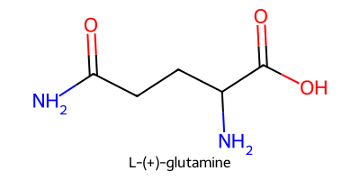
    


```python
Image(filename="tests/output/GLN_unordered.png")
```


    
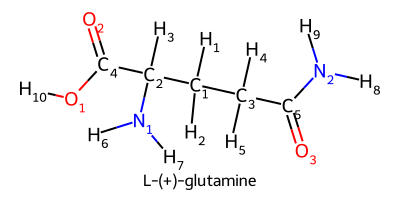
    


```python
Image(filename="tests/output/GLN_ordered.png")
```


    

    


```python
Image(filename='tests/output/GLN_monomer.png')
```


    

    


# Construct a polymer from a set of monomers

 


```python
dipeptide = Polymer(ARG_monomer)
dipeptide.extend(GLN_monomer, from_junction_name = "C", to_junction_name = "N")
dipeptide.topology.title = "ARG-GLN Dipeptide"
Visualize.polymer(dipeptide).draw2D('tests/output/dipeptide.png',(400,200))
Image(filename='tests/output/dipeptide.png')
```


    
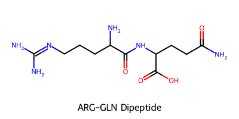
    


# large polymer 

We'll take a monomer like ethylene terephthalate and polymerize it to a large polymer PET.  There appears to be a problem with inferring bond orders in benzene rings, but this is just a problem for visualization.  We'll show it without inferring bond orders (so no double or triple bonds) to make sure we get the right atom numbers for the polymerization junctions.  The produced ITP should still be correct as bond order is not stored in the ITP file.


```python
eth_topology = Topology.from_ITP('tests/data/ethylene_terephthalate.itp')
Visualize.topology(eth_topology, infer_bond_order=False).draw2D('tests/output/ethylene_terephthalate.png',(400,200), remove_explicit_H=False, show_atom_ID=True)
Image(filename='tests/output/ethylene_terephthalate.png')
```


    
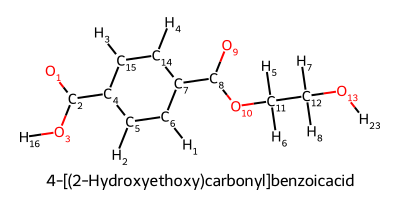
    


## Manually construct double bonds 


```python
eth_topology.get_bond('C2','O1').order = 2
eth_topology.get_bond('C8','O9').order = 2
eth_topology.get_bond('C4','C15').order = 2
eth_topology.get_bond('C7','C14').order = 2
eth_topology.get_bond('C5','C6').order = 2

Visualize.topology(eth_topology, infer_bond_order=False).draw2D('tests/output/ethylene_terephthalate_double_bond.png',(400,200), remove_explicit_H=False, show_atom_ID=True)
Image(filename='tests/output/ethylene_terephthalate_double_bond.png')
```


    
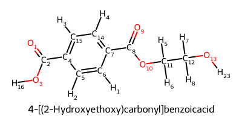
    


## Set the junctions to create a monomer


```python
ETH_A = eth_topology.junction('C12','O13').named('A')
ETH_B = eth_topology.junction('O3','H16').named('B')
ETH_monomer = Monomer(eth_topology, [ETH_A, ETH_B])
Visualize.monomer(ETH_monomer, infer_bond_order=False).draw2D('tests/output/ETH_monomer.png',(400,200),highlight_junctions=True)
Image(filename='tests/output/ETH_monomer.png')
```


    
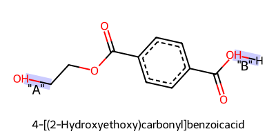
    


## Create polymer from 3-5 monomers

PET is usually made from 100-200 monomers but that would not be visible so we'll just make a small one here.


```python
import random
monomer_number = random.randint(3,5)
polymer = Polymer(ETH_monomer)
for i in range(monomer_number-1):
    polymer.extend(ETH_monomer, from_junction_name = "B", to_junction_name = "A")
polymer.topology.title = f"PET polymer ({monomer_number} units)"
Visualize.polymer(polymer, infer_bond_order=False).draw2D('tests/output/PET_polymer.png',(800,200), show_legend=True)
Image(filename='tests/output/PET_polymer.png')
```


    
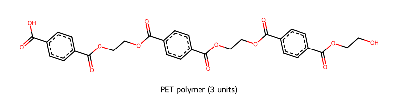
    


# More complex polymers

We'll model a simple form of glycogen (skipping the glycogenin protein nucleating the **C** chain in the center of the polymer), which is a complex polymer of glucose molecules.  https://chem.libretexts.org/Bookshelves/Biological_Chemistry/Supplemental_Modules_(Biological_Chemistry)/Carbohydrates/Polysaccharides/Glycogen

The structure is characterized by chains 8-10 units long of glucose molecules linked by alpha-1,4-glycosidic bonds, with branches linked by alpha-1,6-glycosidic bonds.  There are three category of chains, **A**, **B**, and **C**, they are 8-10 monomers long, at the end of each chain is a glucose monomer with 3 branch points. There is one **C** chain at the center of the polymer.  For this simplification that **C** chain, will be branch to 2 **B** chains, and each **B** will branch to 4  **A** chains.

### Load monomer - glucose

Note in this topology file;
The C1 glycosidic junction is C₅O₄H₃ 
The C6 glycosidic junction is C₆O₂H₁ 
The C4 glycosidic junction is C₁O₃H₂ 

We'll keep the oxygen in the C4 and C6 glycosidic bond and remove the oxygen in the C1 glycosidic bond so we can construct both 1,4 glycosidic bonds and 1,6 glycosidic bonds.


```python
glucose_topology = Topology.from_ITP('tests/data/glucose.itp')
Visualize.topology(glucose_topology).draw2D('tests/output/glucose.png',(400,200), remove_explicit_H=False, show_atom_ID=True)
Image(filename='tests/output/glucose.png')
```


    

    


# Load monomer

Let's start with a simple molecule of glucose, and only one of the isomers (the cyclic form), but it would be possible to model others such as the open chain form as well, and to distribute randomly among multiple given an experimentally derived distribution.  We'll create 3 monomers, one with 1,4 junctions, one with 1,6 junctions, and one with all 3 junctions.  We'll only use the 14 monomers to construct the A chains so there is no chance of a branch from the A chain.  We'll use the 146 monomer to make the B and C chains, but we'll make the B chains first and there should be just 1 1 junction remaining to connect it to the C branch. We'll make the 16 monomer just for completeness (to create other starches like amylase)


```python
glucose_topology = Topology.from_ITP('tests/data/glucose.itp')

alpha1 = glucose_topology.junction('C5','O4').named('1')
alpha6 = glucose_topology.junction('O2','H1').named('6')
alpha4 = glucose_topology.junction('O3','H2').named('4')
glucose_topology.title= "Cyclic glucose monomer"

Glucose_14 = Monomer(glucose_topology, [alpha1, alpha4])
Glucose_16 = Monomer(glucose_topology, [alpha1, alpha6])
Glucose_146 = Monomer(glucose_topology, [alpha1, alpha4, alpha6])

Visualize.monomer(Glucose_14).draw2D('tests/output/glucose_14.png',(400,200),highlight_junctions=True)
Visualize.monomer(Glucose_16).draw2D('tests/output/glucose_16.png',(400,200),highlight_junctions=True)
Visualize.monomer(Glucose_146).draw2D('tests/output/glucose_146.png',(400,200),highlight_junctions=True)

```

## Glucose monomers


```python
Image(filename='tests/output/glucose_14.png')
```


    
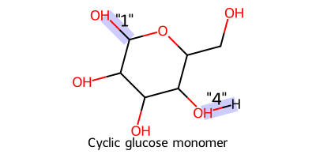
    


```python
Image(filename='tests/output/glucose_16.png')
```


    
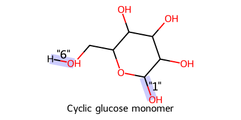
    


```python
Image(filename='tests/output/glucose_146.png')
```


    
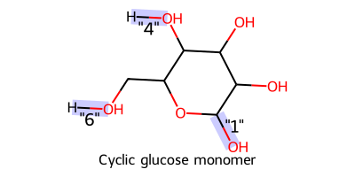
    


# Create A chains


```python
import random
random.seed(42) # for reproducability

def create_14_chain(n):
    A_chain = Polymer(Glucose_14)
    for i in range(n-1):
        A_chain.extend(Glucose_14, from_junction_name = "1", to_junction_name = "4")
    return A_chain

A_chains = []

for i in range(4):
    n = random.randint(8,10)
    chain = create_14_chain(n)
    chain.topology.title = f"Alpha chain of length {n}"
    chain_as_monomer = Monomer.from_Polymer(chain)

    Visualize.monomer(chain_as_monomer).draw2D(f'tests/output/alpha{i}.png',(400,200),highlight_junctions=True)
    A_chains.append(f'tests/output/alpha{i}.png')


```

## A Chains

Note: the difference in the shape of the images is an artifact of the visualization software (rdkit) attempting to render a 2D schematic representation of the topologies.  In a 3D visualization the shapes should be similar.  However, under simulation the absence of a dihedral constraint across the junction, that it is not possible to infer from the monomer topologies, which otherwise constrains rotation at the junction bond, will likely result in a more .


```python
Image(filename='tests/output/alpha0.png')
```


    
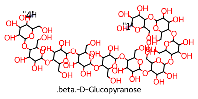
    


```python
Image(filename='tests/output/alpha1.png')
```


    
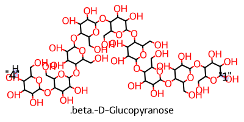
    


```python
Image(filename='tests/output/alpha2.png')
```


    
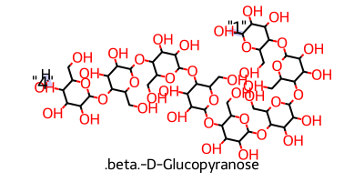
    


```python
Image(filename='tests/output/alpha3.png')
```


    
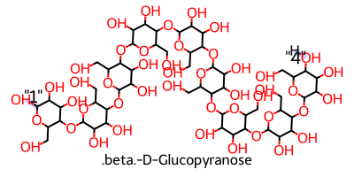
    


## Create B Chains


```python
import random

def create_146_chain(n):
    B_chain = Polymer(Glucose_146)
    for i in range(n-1):
        B_chain.extend(Glucose_146, from_junction_name = "1", to_junction_name = "4")
    return B_chain

# Construct 2 B chains with 4 A chains branched from each B chain
B_chains=[]
for i in range(2):
    chain = create_146_chain(random.randint(8,10))
    for j in range(4):
        A_chain = create_14_chain(random.randint(8,10))
        A_chain_as_monomer = Monomer.from_Polymer(A_chain)
        chain.extend(A_chain_as_monomer, from_junction_name = "6", to_junction_name = "1")
    chain.topology.title = f"Beta chain {i}"
    chain_as_monomer = Monomer.from_Polymer(chain)
    B_chains.append(chain_as_monomer)
    Visualize.monomer(chain_as_monomer).draw2D(f'tests/output/beta{i}.png',(400,200),highlight_junctions=True)

```

## B Chains


```python
Image(filename='tests/output/beta0.png')
```


    
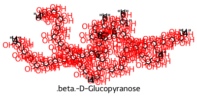
    


```python
Image(filename='tests/output/beta1.png')
```


    
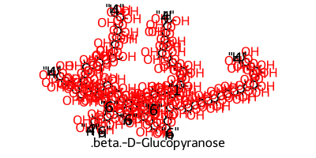
    


# Create glycogen polymer


```python
C_chain = create_146_chain(random.randint(8,10))
C_chain.topology.title = "Glycogen"
Glycogen = C_chain
for monomer in B_chains:
    Glycogen.extend(monomer, from_junction_name = "6", to_junction_name = "1")

Visualize.polymer(Glycogen).draw2D('tests/output/glycogen.png',(800,400))
Image(filename='tests/output/glycogen.png')
```


    
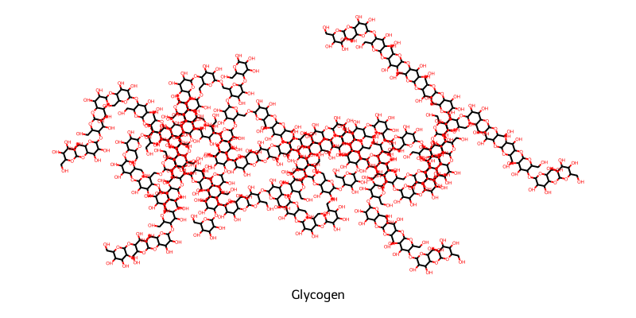
    


